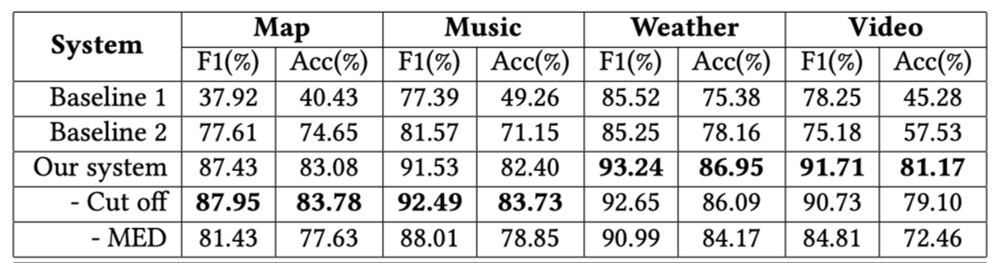

## Introduction

This is a code for our paper ***Multi-Classification Model for Spoken Language Understanding*** published in the 1st Chinese Audio-Textual Spoken Language Understanding Challenge ([CATSLU](https://sites.google.com/view/CATSLU/home)), [ICMI 2019](https://icmi.acm.org/2019/index.php).

The dataset can be downloaded from https://drive.google.com/file/d/1Wpzfq_qbUJm2ddjUO9oNYBAG83MJZxf2/view?usp=sharing.


The evaluation result on test set is shown as bellow.



## Requires

- python 3 

- requirements.txt 


## Train and eval

Get dataset and put it into folder `data`. 

```shell
data
├── map
│   ├── audios
│   ├── development.json
│   ├── lexicon
│   ├── ontology.json
│   ├── test_unlabelled.json
│   └── train.json
├── music
│   ├──....
├── video
│   ├──....
└── weather
    ├──....
```

Just run the shell scripts

```shell
bash run.sh
```


## Generate test results

Assume the test file name is `test_unlabelled.json`.

If the `data_dir` is` ./data/music`, we have

```shell
python tagNet/infer.py --task_name=music --data_dir=./data/music --output_dir=./experiment/bert/music
```

and the result will write in `./experiment/bert/write_results.json`.

Note that  `output` dir includes `config.json`、`pytorch_model.bin`、`vocab.txt`.

## Cite

```bibtex
@inproceedings{Tan_2019_Multi,
  author = {Tan, Chaohong and Ling, Zhenhua},
  title = {Multi-Classification Model for Spoken Language Understanding},
  year = {2019},
  url = {https://doi.org/10.1145/3340555.3356099},
  booktitle = {2019 International Conference on Multimodal Interaction},
  pages = {526–530}
}
```

